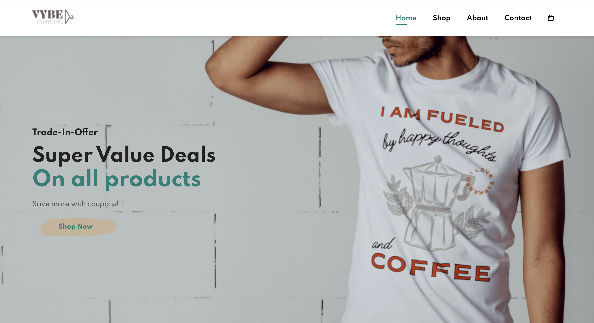
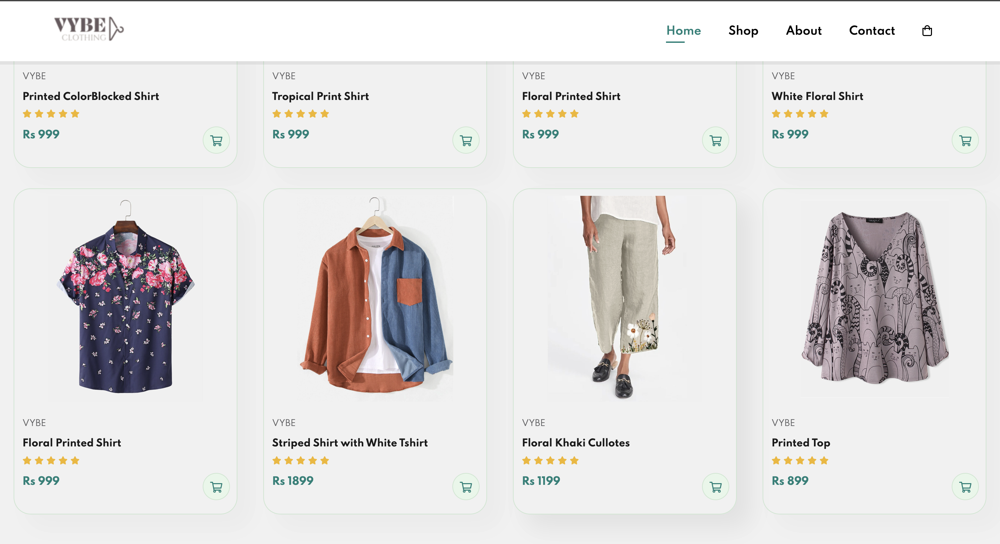
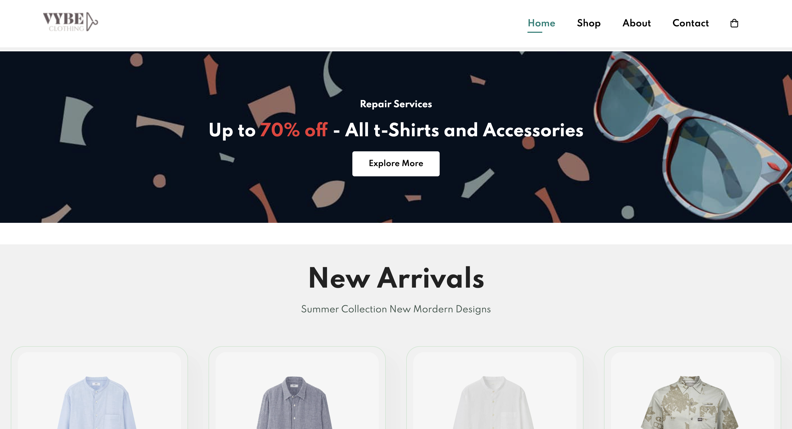

# VYBE – E-Commerce Store

A full-stack e-commerce web application featuring dynamic cart management and secure checkout powered by PHP and MySQL.

## Features
- Product browsing and shopping pages
- Add to cart functionality
- Cart management (update quantity, remove items)
- LocalStorage-based cart persistence
- Checkout system with order processing
- Orders stored in MySQL database
- Dynamic Order ID generation

## Tech Stack
- HTML
- CSS
- JavaScript
- PHP
- MySQL
- XAMPP

## My Contributions
- Built the About and Contact pages (UI + layout)
- Contributed to Cart functionality and item management
- Implemented LocalStorage-based cart logic
- Worked on PHP backend for checkout and order processing
- Assisted in database design (orders & order_items tables)

## Setup Instructions
1. Install XAMPP or MAMP
2. Move project folder into `htdocs`
3. Start Apache & MySQL
4. Open `http://localhost/vybe-ecommerce-store`

## Screenshots
### Home Page

### Shop Page

### About Page

### Contact Page

### Cart Page

## 👥 Team Project
Developed as a group academic project with 2 teammates.
